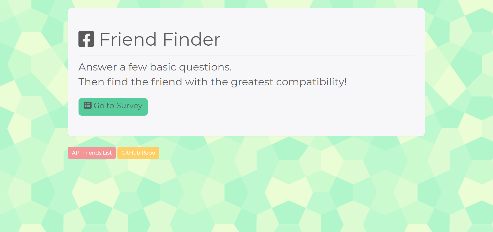

# FriendFinder

**Creator**: `Scott Ladd`

**Created on**: `Nov 18th 2019`

- - -

## ABOUT THE APP
Friend Finder is basically a dating app. This full-stack site takes in results from users' surveys, then it compares their answers with those from other users. The app will then display the name and picture of the user with the best overall match.

The front end design was created using HTML, CSS, Javascript, and BootStrap. The backend components comprised of Javascript, Nodejs, 
and these 3 Node packages: [Express](https://www.npmjs.com/package/express) | [Nodemon](https://www.npmjs.com/package/nodemon) | 
[Path](https://www.npmjs.com/package/path).

- - -

## Deployed Site

This App is deployed on *Heroku* [click Here](https://friendfinder1425.herokuapp.com/) to view it.

- - -

## TECHNOLOGIES USED
* BootStrap
* FontAwesome
* HTML
* CSS
* Javascript
* Nodejs
* Node packages:
    * Express
    * Nodemon
    * Path
* Git
* GitHub